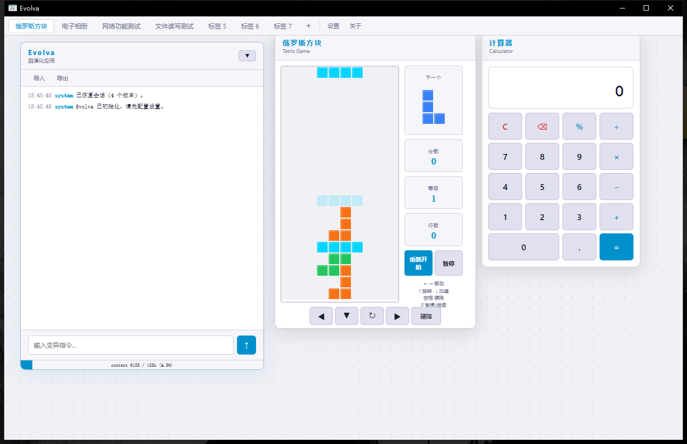

# Evolva

一个能够**自我演化**的桌面应用。用户通过自然语言指令描述想要的 UI 变更，应用捕获当前 DOM 状态发送给 LLM，接收生成的 JavaScript 代码并在隔离的 iframe 中动态执行——形成持续的自修改循环。支持多标签页，每个标签页拥有独立的变异空间与操作历史。

基于 [Tauri v2](https://v2.tauri.app/) 构建，前端使用纯 HTML/CSS/JS，后端使用 Rust。



> **灵感来源**：本项目灵感来自 [Ouroboros](https://ki-seki.github.io/features/ouroboros/landing.html)——一个基于浏览器的自修改网页实验。Evolva 将这一理念延伸至桌面端，通过 Tauri + Rust 实现更安全的能力隔离与更丰富的沙盒权限控制。

## 工作原理

```
用户输入指令 → 捕获当前 DOM → 压缩后发送至 LLM → 接收 JS 代码 → 动态注入执行 → UI 更新
                                      ↑                                              |
                                      └────────── 下一次修改的起点 ──────────────────┘
```

1. **DOM 捕获** — 剥离 `<script>` 标签，压缩空白，减少上下文占用
2. **LLM 代理** — Rust 后端转发请求至 OpenAI / Anthropic API，绕过 webview CORS 限制
3. **代码提取** — 从 LLM 返回的 markdown 代码块中解析 JavaScript
4. **沙盒隔离** — iframe 内运行 sandbox.js 拦截层，代理 fetch/import/文件/存储/剪贴板等 API，权限可配置
5. **动态注入** — 将 `require()`/`import()` 转换为 `evolva.import()` 代理，以 async IIFE 注入执行

## 功能特性

- **多标签页** — 每个标签页拥有独立的变异空间（iframe）、控制面板和操作历史，互不干扰
- **自然语言驱动** — 用中文或英文描述 UI 改动，LLM 生成代码并即时生效
- **多协议支持** — 兼容 OpenAI 和 Anthropic 两种 API 协议
- **沙盒权限控制** — 独立控制网络访问、文件读写、持久存储、剪贴板等权限
- **上下文监控** — 每个标签页实时显示 token 用量和上下文窗口占用比例
- **会话持久化** — 自动保存每个标签页的变异历史，重启后可恢复
- **暗/亮主题** — 一键切换，主题和语言设置持久化到配置文件
- **导入/导出** — 将标签页的变异历史导出为 JSON，支持导入回放

## 快速开始

### 环境要求

- [Rust](https://www.rust-lang.org/tools/install) (stable)
- [Node.js](https://nodejs.org/) (v18+)
- 系统依赖参见 [Tauri 官方文档](https://v2.tauri.app/start/prerequisites/)

### 安装与运行

```bash
# 克隆仓库
git clone https://github.com/wuyan19/evolva.git
cd evolva

# 安装前端依赖
npm install

# 开发模式运行
cargo tauri dev
```

### 更新应用图标

将新的图标文件（建议 1024x1024 或更大的 PNG）放到项目根目录，然后执行：

```bash
npx tauri icon app-icon.png
```

该命令会自动在 `src-tauri/icons/` 下生成所有平台所需的图标文件。重新构建后生效。

### 构建发布

```bash
cargo tauri build
```

构建产物位于 `src-tauri/target/release/bundle/`。

## 使用方法

1. 启动应用后，点击标签栏的 **设置** 按钮
2. 填写 API Key、Base URL，选择协议（OpenAI / Anthropic）和模型名称
3. 在输入框描述想要的 UI 变更（例如："把背景改成渐变色"、"添加一个时钟组件"）
4. 按 **Enter** 或点击发送按钮
5. LLM 生成的代码将自动注入并执行

### 标签页操作

| 操作 | 方式 |
|------|------|
| 新建标签页 | 点击标签栏 `+` 按钮或 `Ctrl+T` |
| 关闭标签页 | 点击标签页上的 `×` 或 `Ctrl+W` |
| 切换标签页 | 点击标签页或 `Ctrl+Tab` / `Ctrl+Shift+Tab` |
| 重命名标签页 | 双击标签页名称 |

## 项目结构

```
evolva/
├── src/
│   ├── index.html            # 页面结构
│   ├── style.css             # 样式与主题
│   ├── app.js                # 前端逻辑（TabState、i18n、标签管理、权限代理）
│   └── sandbox.js            # iframe 沙盒拦截层（fetch/import/存储/剪贴板代理）
├── src-tauri/
│   ├── src/
│   │   ├── lib.rs            # Rust 后端（LLM API 代理、沙盒命令、状态管理、持久化）
│   │   └── main.rs           # 入口点
│   ├── Cargo.toml            # Rust 依赖配置
│   └── tauri.conf.json       # Tauri 应用配置
└── package.json              # npm 配置（Tauri CLI）
```

## 技术栈

| 层级 | 技术 |
|------|------|
| 桌面框架 | Tauri v2 |
| 前端 | HTML / CSS / JavaScript（无框架，无构建步骤） |
| 后端 | Rust |
| HTTP 客户端 | reqwest 0.12 |
| 交互 | interact.js (CDN) |
| AI 接口 | OpenAI / Anthropic API |

## 开发

```bash
cargo tauri dev       # 开发模式
cargo check           # 检查 Rust 编译错误
```

## 许可证

MIT
